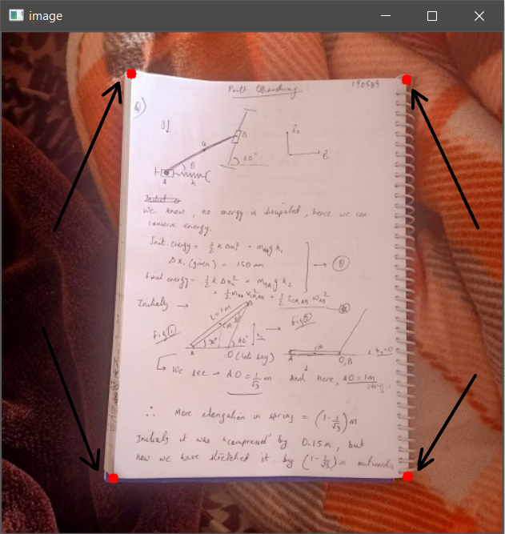
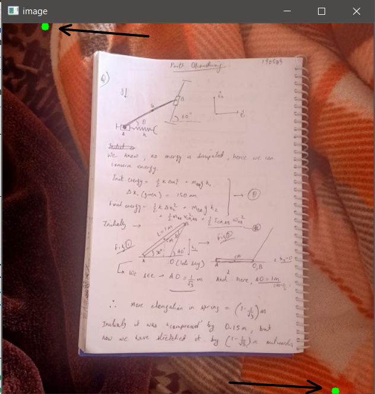
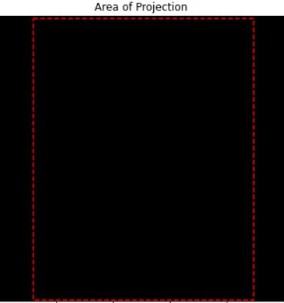
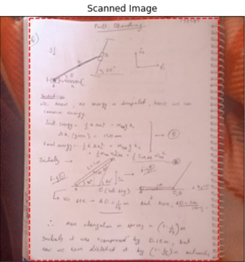

# Image_Scanning

This is a python program to scan an image. You can select the coordinates of the section of the image you want to scan(can select 4 coordinates).

So, firstly we will load the image and the program will ask us to "click" on the 4 points of the image which we want to choose as the corners of the section to be scanned.
(During this click event, the machine records the coordinates of the point on the image where we click)

Then, we have to click on the points on the image, which we want to choose as the extreme ends of the area of projection for the scanned image.

Finally, the third section of the code takes the recorded coordinates from the previous section of the code, and then outputs our final scanned image(through the function - project_transform() )

The image above points to the region we have our interest in e.i. we want to scan.
 

And this image corresponds to the final rectangle that we want our image to fir into.

   
   

And finally, this is our scanned image, according to the points we chose, along with the original image beside it.
